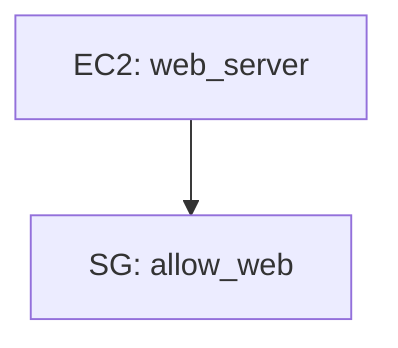

# terraform-drift-analyzer

A Claude Agent Skill that detects infrastructure drift between your Terraform `*.tf` declarations and live AWS resources. Produces a single `report.md` with an embedded Mermaid architecture diagram and full drift analysis.

## What It Does

Compares what you've declared in Terraform against what actually exists in AWS and reports:
- ✅ **Matched** — declared and found, config agrees
- ❌ **Missing** — declared in `.tf` but not found in AWS
- ⚠️ **Mismatched** — found in both but config fields differ
- 🔍 **Unmanaged** — in AWS but not in your Terraform

## Supported Resources

| Terraform Type | AWS Resource |
|---|---|
| `aws_instance` | EC2 Instances |
| `aws_s3_bucket` | S3 Buckets |
| `aws_iam_role` | IAM Roles |
| `aws_iam_user` | IAM Users |
| `aws_iam_policy` | IAM Policies (customer-managed) |
| `aws_security_group` | Security Groups |

## Prerequisites

1. **Claude Code** with AWS MCP server connected
2. **Python 3.8+** with dependencies:
   ```bash
   pip install python-hcl2
   ```
3. **Terraform files** — a directory of `*.tf` files to analyze

## Installation

### Local (Personal Use)

Copy the skill folder into your Claude skills directory:
```bash
cp -r terraform-drift-analyzer ~/.claude/skills/
```

### Project-Level

Copy into your project's Claude skills directory:
```bash
cp -r terraform-drift-analyzer .claude/skills/
```

### Verify Installation

In Claude, type:
> "Check my Terraform files for drift"

Claude should recognize and activate the skill.

## Usage

### Step 1 — Connect AWS MCP

In Claude settings, add and authenticate the AWS MCP server. Verify it's working by asking Claude: *"List my AWS regions."*

### Step 2 — Trigger the Skill

Say one of:
- "Check my Terraform files for drift"
- "What's different between my .tf files and AWS?"
- "Run a drift analysis on my infrastructure"
- "What changed in AWS vs my Terraform?"

### Step 3 — Provide Your Terraform Directory

Claude will ask: *"What is the path to your Terraform directory?"*

Respond with the absolute path, e.g.:
```
/home/user/infra/terraform/prod
```

### Step 4 — Review report.md

Claude runs the pipeline and produces `report.md` in your working directory. The report includes:
- A Mermaid architecture diagram of your declared resources
- A summary table (total declared, found, missing, unmanaged, mismatched)
- Per-resource-type drift findings
- A section listing unmanaged AWS resources

## Example Output

````markdown
# Terraform Drift Report
Generated: 2026-06-04 07:00 UTC

## Architecture


## Summary
| Metric | Count |
|--------|-------|
| Total Declared | 3 |
| Total Found | 2 |
| Missing | 1 |
| Unmanaged | 1 |
| Mismatched | 1 |

## Drift Findings
### EC2 Instances
- ⚠️ web_server (i-0abc123) — mismatched (instance_type: declared `t3.micro`, actual `t3.large`)

### S3 Buckets
- ❌ logs_bucket — missing in AWS

## Unmanaged Resources
- 🔍 EC2 Instances: old_worker (i-0xyz999)
````

## Resource Matching

Resources are matched by:
1. **Primary:** Terraform resource name → AWS `Name` tag
2. **Fallback:** `terraform:resource` tag on the AWS resource (format: `aws_instance.web_server`)
3. **Neither:** flagged as `unmanaged`

Tag your AWS resources with `Name = "<terraform_resource_name>"` for best results.

## Running Manually

Each pipeline stage can be run independently:

```bash
# 1. Parse Terraform files
python3 terraform-drift-analyzer/scripts/terraform_parser.py /path/to/terraform

# 2. Generate discovery plan
python3 terraform-drift-analyzer/scripts/aws_discovery.py drift-workspace/T.json plan

# 3. Normalize MCP responses (after executing queries)
python3 terraform-drift-analyzer/scripts/aws_discovery.py drift-workspace/T.json normalize mcp_response.json

# 4. Detect drift
python3 terraform-drift-analyzer/scripts/drift_detector.py drift-workspace/T.json drift-workspace/A.json

# 5. Generate report
python3 terraform-drift-analyzer/scripts/report_generator.py drift-workspace/diff.json drift-workspace/architecture.mmd
```

## Running Tests

```bash
pip install pytest
pytest tests/ -v
```

## Known Limitations

- Only the 6 resource types above are analyzed; others are silently skipped
- `.tfstate` files are not used — comparison is always declaration vs live AWS
- Terraform variable values not resolvable at parse time are marked as `<variable: var.name>`
- Duplicate resource names (same type + name across files) use the first occurrence
- Security group ingress/egress rule format differs between HCL and AWS API — only tag drift is detected for SGs in v1
- Single AWS account and region per run (determined by connected AWS MCP)

## Project Structure

```
terraform-drift-analyzer/
├── SKILL.md                    # Claude activation instructions
├── scripts/
│   ├── terraform_parser.py     # .tf → T.json + architecture.mmd
│   ├── aws_discovery.py        # T.json → A.json (via AWS MCP)
│   ├── drift_detector.py       # T.json + A.json → diff.json
│   └── report_generator.py     # diff.json → report.md
└── references/
    └── usage.md                # Detailed usage documentation
```

## License

MIT
