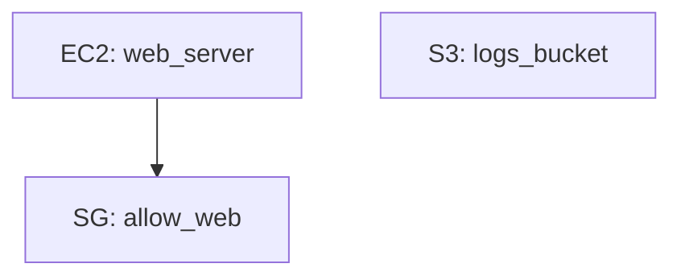

# Terraform Drift Report
Generated: 2026-06-04 06:42 UTC

## Architecture

## Summary

| Metric | Count |
|--------|-------|
| Total Declared | 3 |
| Total Found | 2 |
| Missing | 1 |
| Unmanaged | 1 |
| Mismatched | 2 |

## Drift Findings

### EC2 Instances
- ⚠️ web_server — mismatched (instance_type: declared `t3.micro`, actual `t3.large`)

### S3 Buckets
- ❌ logs_bucket — missing in AWS

### Security Groups
- ⚠️ allow_web — mismatched (ingress: declared `[{'from_port': 443, 'to_port': 443, 'protocol': 'tcp', 'cidr_blocks': ['0.0.0.0/0']}]`, actual `[]`)

## Unmanaged Resources
Resources found in AWS not declared in Terraform:

- 🔍 EC2 Instances: orphan_server
